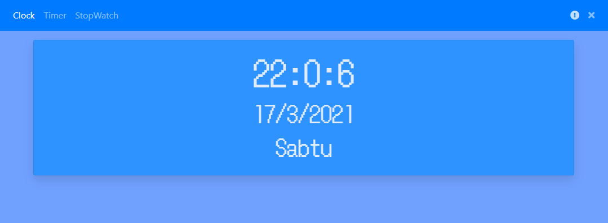
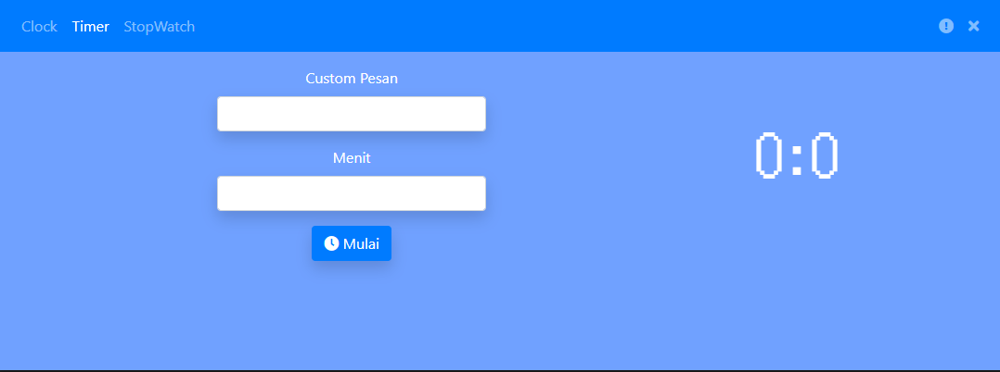
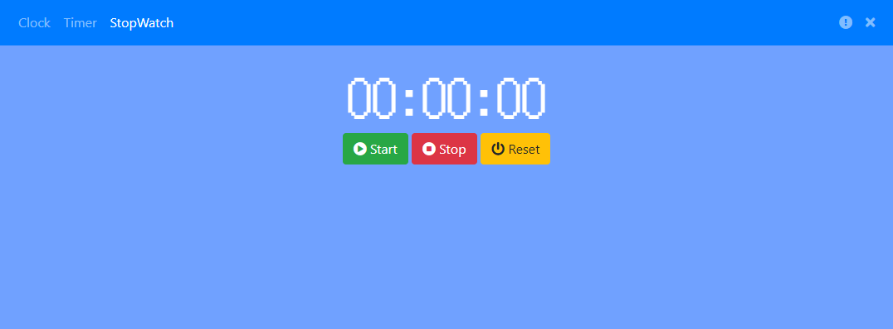

# Clocktime

Clocktime merupakan aplikasi sederhana menampilkan waktu, dan dilengkapi dengan fitur tambahan seperti timer, dan stopwatch. Clocktime dibuat dengan menggunakan framework UI Bootstrap 4 dan Jquery dan dibangun dengan menggunakan teknologi Electron

# Screenshot

#### Cloktime

#### Timer

#### Stopwatch

# Library yang Digunakan

* [Electron](https://electronjs.org)
* [Bootstrap](https://getbootstrap.com)
* [Jquery](https://jquery.com)
* [Fontawesome](https://fontawesome.com)

# Source Credit

* Icon berasal dari [Paomedia](https://www.iconfinder.com/paomedia)